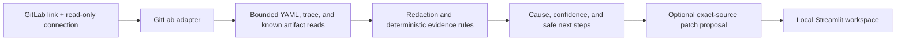

# PipelineLens

**A local, read-only CI failure investigator for GitLab pipelines.**

Paste a GitLab pipeline, job, branch, file, or repository URL. PipelineLens reads bounded
evidence, identifies the earliest supported failure, links the controlling source, and shows
an unapplied Git-style patch only when it verifies the exact source file at the failed commit.

It does not rerun jobs, modify repository files, approve merge requests, change secrets,
deploy software, or apply a proposed patch.

## Why this exists

GitLab Duo and other hosted "AI reads your pipeline" features already exist. PipelineLens is
not trying to out-summarize them with a bigger model. It optimizes for a different, narrower
guarantee: **every claim is falsifiable.**

- **Cited, not narrated.** Each answer points at one exact log line, one exact source location
  at the failed commit, or one exact structured artifact field — never a fluent paragraph you
  have to trust. If no rule matches, it says "unknown" instead of guessing a plausible story.
- **Two separate confidences, not one vibe.** Cause confidence and fix confidence are scored and
  shown independently. A high-confidence cause with a low-confidence fix stays visibly
  unresolved, instead of being smoothed into one reassuring number.
- **A patch is a proof, not a suggestion.** A diff is only shown when the exact source file at
  the exact failed-pipeline SHA was read, confirmed unmodified by redaction, and matches the
  rule's narrow, hand-written condition. There is no generic "let the model write a diff" path.
- **Deterministic and auditable.** The same evidence always produces the same verdict. Every
  rule is source-controlled, unit-tested (2,000+ tests), and readable — you can point at the
  exact regex or field check that fired, not a model weight you cannot inspect.
- **Portable across your actual stack.** One evidence format for GitLab CI/CD (and a GitHub
  Actions adapter), instead of a feature that only exists inside one vendor's hosted UI.
- **Your own history grows the same transparent rule surface.** The local, public, and dataset
  corpora below all feed the same deterministic classifier, so coverage growth is visible rule
  IDs and counts you can read — not a fine-tuned black box you have to trust blindly.
- **Data residency is real, just not the whole pitch.** For an on-prem GitLab or
  company-sensitive pipeline, not uploading logs to a hosted model by default is a genuine
  requirement for many teams — it is one reason among several here, not a substitute for the
  rest of this list.
- **Escalation is opt-in, not mandatory.** When a cause is genuinely unresolved, you can
  explicitly ask a cloud model (Gemini) for a second opinion with your own key. The deterministic
  verdict stays primary either way; nothing is silently routed to a vendor's model by default.

## What it demonstrates

- A minimal paste-and-analyze interface: specific cause, evidence, confidence, and a review-only fix.
- Exact source-line links and conditional unified diffs only when source provenance is verified.
- GitLab local and cross-project CI include resolution at the pipeline commit.
- Bounded job traces, changed-file context, downstream evidence, and one known RLP DataSync artifact summary.
- Credential redaction before display or local persistence.
- Local rule evaluation, curated public documentation hints, and human-confirmed resolutions.
- Opt-in Windows-encrypted connection reuse and disclosed local diagnostic notes.
- Local GitLab, public-GitHub, and offline-dataset failure corpora for deterministic rule
  evaluation, not model training.
- An explicit, off-by-default cloud assist (Gemini) for the rare unresolved cause — never on
  by default, never mixed into the deterministic verdict.

## Using the dashboard

1. Paste a GitLab pipeline, job, branch, file, or repository link and select **Analyze**.
2. Read the primary cause, separate cause/fix confidence scores, and recommended checks.
3. Review an exact source diff when one is justified. Otherwise, use the diagnostic evidence,
   source context, and documentation; no patch is guessed.
4. Expand **Evidence & details** for additional findings, job status, CI includes, and limits.

```text
GitLab link -> bounded evidence -> specific cause -> confidence -> review-only source diff
```

For artifact-backed DataSync failures, the deployment counters and evidence link appear directly
on the answer card. Compatibility skips are not failed requests. A connection reset explains the
observed transport interruption, not which network component caused it or whether a retry is safe.

## Quick start

Requires Python 3.11+; this workstation uses the existing system Python 3.13.5 and installed
dependencies. Adjust the project/interpreter locations below for another workstation. No virtual
environment or model download is required. A fresh installation needs the package dependencies
from the project metadata; the Docker build installs these automatically.

```powershell
$root = 'C:\Users\phanindra.pvs\Desktop\RLP-SCRIPTS\PipelineLens'
$python = 'C:\Python313\python.exe'

Start-Process powershell.exe -ArgumentList @(
    '-NoExit', '-Command',
    "Set-Location -LiteralPath '$root'; `$env:PYTHONPATH = '$root\src'; `$env:PIPELINELENS_LLM_MODE = 'disabled'; `$env:PIPELINELENS_ALLOW_PRIVATE_CONTEXT = 'false'; & '$python' -m uvicorn pipelinelens.api.main:app --host 127.0.0.1 --port 8000"
)
Start-Process powershell.exe -ArgumentList @(
    '-NoExit', '-Command',
    "Set-Location -LiteralPath '$root'; `$env:PYTHONPATH = '$root\src'; `$env:PIPELINELENS_API_URL = 'http://127.0.0.1:8000'; & '$python' -m streamlit run src/pipelinelens/dashboard/app.py --server.address 127.0.0.1 --server.port 8501 --server.fileWatcherType none --browser.gatherUsageStats false"
)
Start-Process 'http://127.0.0.1:8501'
```

The API binds to `127.0.0.1` and the dashboard calls localhost only. Paste a pipeline,
job, branch, file, or repository URL into `http://127.0.0.1:8501`.
This stable Windows launch disables file watching; restart the dashboard after source edits.

## Paste a GitLab pipeline URL

For a local self-hosted GitLab setup, add the following values to your ignored `.env` file:

```dotenv
PIPELINELENS_ENV=development
PIPELINELENS_GITLAB_BASE_URL=https://gitlab.example
PIPELINELENS_GITLAB_TOKEN=your-read-only-token
```

Restart FastAPI, open the dashboard, and paste a complete failed-pipeline URL such as:

```text
https://gitlab.example/group/project/-/pipelines/123
```

PipelineLens verifies the expected GitLab host, resolves the project, confirms access, finds
failed jobs, and analyzes a bounded sample. The dashboard accepts a request-only read-only GitLab
PAT or, in local development, a configured local connection. Tokens are never included in pasted
URLs or in the diagnostic output.

## Docker Compose

Docker is optional and intended for local demonstration only. The Compose setup runs FastAPI and
Streamlit in one container so the API remains loopback-only even inside Docker. It disables model
and private-context settings, copies no `.env`, local data, saved credentials, or corpus files into
the image, and publishes only the dashboard to the host loopback address.

```powershell
docker compose up --build
```

Open `http://127.0.0.1:8501`. The internal API listens only at `127.0.0.1:8000` inside the
container and is not published. Stop the stack with `docker compose down`.

- Stop any existing host dashboard using port 8501 before starting Compose.
- Enter a request-only GitLab token in **Connection & options**. The Linux container does not
    support Windows DPAPI; it does not import the host's saved connections or environment file.
- The named `pipelinelens-data` volume retains local notes and database state across container
    restarts. It is unencrypted application storage; apply approved host filesystem controls.
- Runtime UID/GID is 10001. Existing volumes created by another user need compatible ownership;
    do not delete retained data to work around a permissions error.
- A small supervisor stops both services if either exits and forwards shutdown to both. Redis,
    PostgreSQL, and worker services are not required for this workflow.
- Do not publish on all network interfaces or put this single-user dashboard behind a public proxy.

Container lifecycle and configuration have automated tests. An actual image build/run still
requires Docker; it was unavailable on the development workstation used for this update.

## Read-only provider connection

The current paste-link dashboard is **GitLab-only**. Use a PAT with `read_api` and
`read_repository` for projects you are authorized to inspect:

- **New token:** used for the current request; the password widget is cleared after the attempt.
- **Automatic:** reuses an explicitly saved Windows connection or a configured same-host local
    connection when available.
- **Save token encrypted on this Windows account:** optional current-user DPAPI storage, separate from diagnostic
    notes. Saving happens only after access has been verified; there is no plaintext fallback.

Configured tokens stay in FastAPI and are locked to their configured GitLab origin. Tokens are
never put in pasted links, diagnostic output, or corpus records.

Provider adapters also include GitHub Actions for separate API workflows, but pasting a GitHub URL
is not supported by this dashboard. The explicit public GitHub corpus below needs no token.

### Evidence limits

- Up to five jobs are inspected by default; the local API permits a budget of one to eight.
    Successful jobs may be sampled for context. A passed pipeline can contain an allowed failure.
- Root CI files use the pipeline commit. Local/shared project includes are followed within
    depth/read budgets (up to 100 CI files and depth 20); unsupported remote/template/component
    includes and access failures are shown explicitly. Mutable shared refs are not historical proof.
- Repository inventory is bounded to 300 entries/depth 6, with up to 280 rows displayed. Absence
    from this list does not prove a source file is missing.
- One failed DataSync job archive may be inspected: 2 MiB compressed, at most 64 members,
    a 1 MiB summary, companion members up to 8 MiB, and 16 MiB total uncompressed. Only the known
    DataSync summary is interpreted; CRC/path/compression/JSON checks remain enforced.
- Inaccessible, expired, oversized, incomplete, or unsupported evidence stays unknown. A complete
    bounded read is not a complete pipeline audit or proof of an intended deployment.

## Analysis flow



The local analyzer evaluates explicit evidence rules. It downloads no model and sends no pipeline
data to an external AI service. The primary answer identifies the observed cause, its rule-based
cause confidence, its separate fix confidence, and supporting redacted evidence. Those values are
heuristics rather than calibrated probabilities. A low fix confidence means the evidence explains
what failed but does not establish a safe source change.

An exact Git-style source diff appears only when PipelineLens reads the candidate file from the
same repository at the failed pipeline SHA, confirms the source was not modified by redaction, and
can prove the narrow replacement. Otherwise it shows a source block or a public documentation
link. A special JSON path can also verify a secret-free hunk against fresh original source without
retaining that original source. Every proposal is review-only; a high score is not a tested fix.

### Local retention is visible

The dashboard discloses **Save diagnostic notes locally** and allows it to be disabled
for each inspection. Notes are enabled by default; turning them off does not erase existing notes.
The local knowledge store keeps bounded observations and a source map, not a full raw-log archive.
Saved credentials use a separate Windows vault. Corpora require their own explicit CLI execution.

Redaction is not a guarantee that business-sensitive information is absent. Notes/corpora are not
encrypted by PipelineLens; review any export before sharing it. Nothing is uploaded automatically,
and corpus recurrence counts never increase confidence scores or mark a fix as verified.

## Local private corpus

Your private repositories can provide local context, but they must never be copied into this public
project, committed, or sent outside an approved environment.

PipelineLens has an opt-in importer that:

- scans CI YAML, selected pipeline traces, and curated runbooks by default;
- ignores `.git`, `.sf`, `.sfdx`, virtual environments, token/secret/credential/password files, `.env` files, and executable credential files;
- redacts supported token and credential patterns before local persistence;
- defaults to preview mode and requires `PIPELINELENS_ALLOW_PRIVATE_CONTEXT=true` plus `--execute` before storing anything;
- keeps imported data under ignored local database paths.

Preview a repository first:

```powershell
$env:PYTHONPATH = "$PWD/src"
python -m pipelinelens.local_corpus "C:\path\to\private-repository" --label "private-ci"
```

Enable private context only after the data and filesystem controls are approved by the organization.
The importer is local and does not make model or provider calls.

```powershell
$env:PIPELINELENS_ALLOW_PRIVATE_CONTEXT = "true"
python -m pipelinelens.local_corpus "C:\path\to\private-repository" --label "private-ci" --execute
```

This is a curated local rule-evaluation workflow, not automatic model training. Resolutions are
retained only after explicit human confirmation; an observation or suggestion never becomes a
verified fix by itself.

## Local Failed-Pipeline Corpus

The local pipeline corpus retains selected, redacted failed-job traces only. It does not retain CI
source, diffs, trees, merge requests, or raw provider responses. It supports offline rule
evaluation, not model training and not a record of verified fixes.

```powershell
Set-Location 'C:\Users\phanindra.pvs\Desktop\RLP-SCRIPTS\PipelineLens'
$env:PYTHONPATH = "$PWD\src"

# Preview only: no GitLab requests and no writes.
C:\Python313\python.exe -m pipelinelens.harvest --project group/project

# Explicit collection: bounded same-host, read-only GitLab GETs.
C:\Python313\python.exe -m pipelinelens.harvest `
    --project group/project-a `
    --project group/project-b `
    --project group/project-c `
    --per-project 75 --concurrency 2 --execute

# Offline only: reclassify retained redacted observations.
C:\Python313\python.exe -m pipelinelens.harvest --reevaluate --execute
C:\Python313\python.exe -m pipelinelens.harvest --summary
```

The store is ignored under `data/corpus/`. It is unencrypted unless an approved filesystem policy
protects it, and can still contain business information after credential redaction. Do not copy it
outside an approved environment.

## Explicit Public GitHub Corpus

The separate public collector accepts only explicit `OWNER/REPOSITORY` names. It sends no
credentials or cookies, performs no repository discovery/search, follows no redirects, and uses
only the fixed public GitHub API. GitHub must report both `private=false` and `visibility=public`
before a repository is retained. Never copy a token into a public collection command.

```powershell
# Preview only: no network and no writes.
C:\Python313\python.exe -m pipelinelens.public_harvest `
    --github-repo actions/checkout --github-repo pallets/flask --github-repo psf/requests `
    --per-repo 2

# Explicit public-only collection. Review each source license first.
C:\Python313\python.exe -m pipelinelens.public_harvest `
    --github-repo actions/checkout `
    --github-repo pallets/flask `
    --github-repo psf/requests `
    --per-repo 2 --execute

# Offline-only reclassification and aggregate counts.
C:\Python313\python.exe -m pipelinelens.public_harvest --reevaluate --execute
C:\Python313\python.exe -m pipelinelens.public_harvest --summary
```

Unauthenticated GitHub Actions logs can be unavailable. PipelineLens deliberately does not follow
signed external log redirects, so a public-corpus entry can contain workflow context only. Public
source and logs remain subject to their licenses and may be copyrighted. The ignored
`data/public-corpus/` store stays local and is never automatically exported.

Reports separate newly retained runs from existing records and distinguish captured logs,
classified jobs, missing jobs, forbidden/redirected logs, and workflow-only context. Exit code 3
means partial coverage or rate limiting, not a silent success; no retries or bypasses are attempted.
Missing or invalid workflow YAML does not block classifying an otherwise usable captured log.

The small initial sample retained six runs and six workflow files from the three repositories above,
but **zero usable job logs and zero diagnoses**: four log requests were forbidden, and two runs
exposed no failed job. This is a coverage limitation, not evidence of diagnostic accuracy.

## External Dataset Import (e.g. a local Kaggle CSV)

A third, separate importer reclassifies a CI/CD log dataset **you already downloaded** —
PipelineLens never logs into, scrapes, or fetches any dataset site itself. Point it at a local
CSV; it redacts and bounds each row's text, classifies it with the exact same deterministic
rules used for a live inspection, and stores only a redacted excerpt plus a content hash (never
the original text) so re-imports de-duplicate safely.

```powershell
# Preview only: validates the path/header, no reads of row data and no writes.
C:\Python313\python.exe -m pipelinelens.dataset_harvest `
    --csv "C:\path\to\downloaded-dataset.csv" --source-label kaggle-cicd-logs

# Explicit import. --text-column/--label-column only if the header name isn't a common guess
# (log, logs, log_text, message, output, text, content, trace).
C:\Python313\python.exe -m pipelinelens.dataset_harvest `
    --csv "C:\path\to\downloaded-dataset.csv" --source-label kaggle-cicd-logs `
    --text-column log_text --label-column status --limit 500 --execute

# Offline-only reclassification and aggregate counts.
C:\Python313\python.exe -m pipelinelens.dataset_harvest --reevaluate --execute
C:\Python313\python.exe -m pipelinelens.dataset_harvest --summary
```

This is offline, deterministic reclassification, not model training. A dataset's own
status/label column (if you pass `--label-column`) is stored only as a short redacted string for
your own manual comparison; PipelineLens does not compute or claim an agreement/accuracy score
against it. Review that dataset's license/terms yourself — PipelineLens does not download it for
you. The ignored `data/dataset-corpus/` store stays local.

## Optional cloud assist (Gemini)

Off by default. The deterministic engine always runs first and is always primary. Only when its
primary finding is genuinely unresolved ("unknown") can you additionally opt in, per analysis, to
ask Google's Gemini API for a second opinion.

Enable it locally (ignored `.env`, never committed):

```dotenv
PIPELINELENS_LLM_MODE=gemini
PIPELINELENS_LLM_MODEL=gemini-2.0-flash
PIPELINELENS_LLM_API_KEY=your-own-gemini-api-key
```

Restart FastAPI. The dashboard's **Connection & options** now shows "Ask Gemini if the cause is
unknown" — unchecked by default. When checked and the API is configured, only the redacted rule
name, category, and up to three redacted evidence snippets for that one finding are sent; nothing
else (no full logs, no source, no repository identity, no credentials). The response is shown in
a clearly separate "Cloud assist (Gemini) · optional, unverified" panel and never changes a
confidence score, never becomes a source-patch proposal, and never overrides the local verdict.
Any network or parsing failure silently falls back to no cloud assist; it never breaks the local
result.

For a demo where you want to show the fully local, zero-egress story, leave this unset
(`PIPELINELENS_LLM_MODE` defaults to `disabled`) — that is the recommended default, and the one
used throughout this README's other examples.

## Skill packs and trustworthy learning

Skill packs live under `skills/` and are version-controlled. Each pack contains detection prerequisites, safe diagnostic steps, and prohibited actions. The first five cover authentication failures, missing artifacts, test failures, YAML rule mismatches, and deployment/API failures.

When a developer marks an incident as resolved and records a confirmed resolution, it becomes eligible as historical evidence for later similar incidents. Unresolved incidents can appear as similarity-only context but are never presented as verified fixes.

## Local commands

```powershell
C:\Python313\python.exe -m pytest --override-ini addopts= -q --tb=short -p no:cacheprovider
C:\Python313\python.exe -m ruff check src tests
```

## Deployment

For a public demo, use synthetic examples only. For company pipeline data, deploy only to an
approved tenant with organization-approved authentication, storage, network, and incident-data
controls. The local inspection endpoint is intentionally loopback-only and is not a public API.

## Safety boundaries

- Read-only provider scope only.
- No automatic rerun, merge, approval, deployment, or secret rotation actions.
- Bounded source, trace, and known-artifact reads with redaction before display or local retention.
- Saved Windows credentials and optional retained diagnostic notes are separate; the dashboard discloses note retention and allows it to be disabled per inspection.
- No external call by default. The one optional exception (cloud assist) is off unless you
  configure it and explicitly opt in per analysis; see "Optional cloud assist" above.
- Review each source proposal and validate it through the normal approval process.

## Testing

The test suite covers provider normalization with mocked GitHub/GitLab APIs, bounded artifact
parsing, local/public/dataset corpus safety, the opt-in cloud-assist fallback (mocked, fail-closed),
CI include resolution, YAML source mapping, redaction, exact patch construction, API routes, and
UI state.

## Roadmap

1. More synthetic regressions for currently unknown diagnostic families.
2. Additional bounded structured artifact readers with source-specific validation.
3. GitHub pasted-link inspection and more CI include types with honest visibility limits.
4. A thin VS Code view of the same cited local diagnosis.
