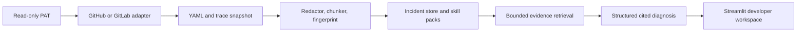

# PipelineLens

**Evidence-first CI failure analysis for GitHub Actions and GitLab CI/CD.**

PipelineLens is a cloud-ready, read-only developer-support tool. For the local GitLab workflow, a developer pastes one failed-pipeline URL; the service verifies access, retrieves its configuration and trace, redacts sensitive values, maps the failure to its YAML job definition, groups recurring incidents, and produces a structured diagnosis that cites observed evidence.

It does not rerun jobs, modify repository files, approve merge requests, change secrets, or deploy software.

## What it demonstrates

- Provider-neutral GitHub Actions and GitLab CI adapters behind one read-only interface.
- Bounded repository structure explorer that keeps CI configuration visible before analysis.
- GitLab local and cross-project include resolution with exact YAML source-line mapping.
- CI dependency graphs, artifact producer/consumer context, and rule visibility.
- Compiler/runtime source-location extraction with provider links when traces include file and line data.
- Log redaction before persistence, retrieval, UI display, or LLM use.
- Deterministic failure classification and stable error fingerprints.
- Recurring-incident clustering and confirmed-resolution feedback.
- Bounded hybrid retrieval: current evidence, similar resolved incidents, and versioned diagnostic skill packs.
- Optional structured LLM synthesis with citation validation and deterministic fallback.
- FastAPI service, Streamlit developer workspace, PostgreSQL/pgvector, Redis/Dramatiq, Docker Compose, and GitHub Actions CI.

## Screenshot

The Streamlit workspace is a single pasted-pipeline workflow:

```text
Failed GitLab pipeline URL -> access check -> project structure -> exact YAML job location
                           -> redacted evidence -> probable fix
```

## Quick start

Requires Python 3.11+.

```powershell
Copy-Item .env.example .env
python -m pip install -e ".[cloud,worker,dev]"
$env:PYTHONPATH = "$PWD/src"
python -m uvicorn pipelinelens.api.main:app --host 127.0.0.1 --port 8000
```

In a second terminal:

```powershell
$env:PYTHONPATH = "$PWD/src"
$env:PIPELINELENS_API_URL = "http://127.0.0.1:8000"
python -m streamlit run src/pipelinelens/dashboard/app.py --server.port 8501
```

Open `http://127.0.0.1:8501` and paste a failed GitLab pipeline URL. The included demo fixtures remain available through the API for tests, but the primary UI is intentionally one field and one action.

## Paste a GitLab pipeline URL

For a local self-hosted GitLab setup, add the following values to your ignored `.env` file:

```dotenv
PIPELINELENS_ENV=development
PIPELINELENS_GITLAB_BASE_URL=https://gitlab.example
PIPELINELENS_GITLAB_TOKEN=your-read-only-token
```

Restart FastAPI, open the dashboard, and paste a complete failed-pipeline URL such as:

```text
https://gitlab.example/group/project/-/pipelines/123
```

PipelineLens verifies that the URL belongs to the expected GitLab host, resolves the project, confirms pipeline access, finds failed jobs, and analyzes up to three failures in one bounded request. The dashboard offers a request-only read-only GitLab PAT on every analysis and, in local development, an explicit option to use a configured server-held connection. Tokens are never included in the pasted URL or persisted by PipelineLens.

## Docker Compose

```powershell
docker compose up --build
```

The dashboard runs at `http://localhost:8501`; FastAPI runs at `http://localhost:8000`; PostgreSQL with pgvector and Redis are started as supporting services.

## Read-only provider connection

PipelineLens supports:

| Provider       | Required read-only access                                                            | v1 behavior                                                                                                    |
| -------------- | ------------------------------------------------------------------------------------ | -------------------------------------------------------------------------------------------------------------- |
| GitHub Actions | Fine-grained PAT: `Contents`, `Actions`, `Metadata`, and `Pull requests` read access | Lists repositories, failed workflow runs/jobs, job trace, and workflow YAML at the failed commit.              |
| GitLab CI/CD   | PAT: `read_api` and `read_repository`                                                | Lists projects, failed pipelines/jobs, traces, root `.gitlab-ci.yml`, and recursively resolves local and accessible cross-project includes. |

When configured locally, the PAT stays in FastAPI and is locked to its configured GitLab host. Otherwise, the dashboard sends a read-only PAT for one request; the API does not persist PATs, request headers, or raw provider responses containing a token.

After selecting a repository, **Repository structure** exposes up to 200 paths, three levels deep. GitLab preserves the root `.gitlab-ci.yml` in this bounded view even when a directory-heavy API page would otherwise hide it.

GitLab remote, template, and component includes are shown as unresolved rather than silently misrepresented. GitHub Actions reusable workflows are a documented v2 enhancement.

For pasted GitLab pipelines, PipelineLens also audits the root configuration and declared local/project includes at the failed pipeline commit. Each source is reported as readable, unreadable, or unresolved. A complete result means every pipeline-referenced CI YAML source discovered within the 20-file safety limit was readable; unsupported GitLab include types and permission-denied sources are explicitly marked as partial visibility.

## Analysis flow



The deterministic analyzer runs first. Behind the scenes, retrieval assembles a bounded RAG bundle from redacted trace chunks, the YAML job definition, matching skill packs, similar historical incidents, and optional approved corpus documents. An approved cloud LLM can improve the explanation only after that bundle is assembled. The answer is rejected if it cites unknown evidence or does not cite anything; PipelineLens falls back to a deterministic diagnosis instead.

RAG and model configuration remain server-side implementation details in the primary workflow. The visible result stays grounded in exact source locations and redacted evidence rather than operating as a black-box log chatbot.

## Enable Cloud RAG

PipelineLens defaults to deterministic diagnosis. To enable RAG synthesis in a cloud deployment, configure an approved OpenAI-compatible endpoint only in the API environment or cloud secret manager.

Set these ignored API environment values and restart FastAPI:

```dotenv
PIPELINELENS_LLM_MODE=openai-compatible
PIPELINELENS_LLM_BASE_URL=https://approved-model-provider.example/v1
PIPELINELENS_LLM_MODEL=approved-model
PIPELINELENS_LLM_API_KEY=stored-in-cloud-secret-manager
```

Each analysis sends only bounded, redacted retrieval context and accepts a model response only when its evidence citations match retrieved source IDs. There is no dashboard toggle, local model install, or browser-held model credential.

## Local private corpus

Your private repositories can provide local retrieval context, but they must never be copied into this public project, committed, or sent to a hosted LLM without explicit approval.

PipelineLens has an opt-in importer that:

- scans CI YAML, selected pipeline traces, and curated runbooks by default;
- ignores `.git`, `.sf`, `.sfdx`, virtual environments, token/secret/credential/password files, `.env` files, and executable credential files;
- redacts supported token and credential patterns before local persistence;
- defaults to preview mode and requires `PIPELINELENS_ALLOW_PRIVATE_CONTEXT=true` plus `--execute` before storing anything;
- keeps imported data under ignored local database paths.

Preview a repository first:

```powershell
$env:PYTHONPATH = "$PWD/src"
python -m pipelinelens.local_corpus "C:\path\to\private-repository" --label "private-ci"
```

For a private corpus, enable it only after the data and the configured cloud provider have been approved by the organization. Do not send private logs, repository files, or runbooks to a hosted model without that approval.

```powershell
$env:PIPELINELENS_ALLOW_PRIVATE_CONTEXT = "true"
python -m pipelinelens.local_corpus "C:\path\to\private-repository" --label "private-ci" --execute
```

This is a curated RAG feedback loop, not automatic model training. Resolved incidents and versioned skill packs provide auditable improvement. Fine-tuning belongs in a later experiment after a sanitized, labeled evaluation dataset exists.

## Skill packs and trustworthy learning

Skill packs live under `skills/` and are version-controlled. Each pack contains detection prerequisites, safe diagnostic steps, and prohibited actions. The first five cover authentication failures, missing artifacts, test failures, YAML rule mismatches, and deployment/API failures.

When a developer marks an incident as resolved and records a confirmed resolution, it becomes eligible as historical evidence for later similar incidents. Unresolved incidents can appear as similarity-only context but are never presented as verified fixes.

## Local commands

```powershell
python -m pytest -q
python -m ruff check src tests
```

## Cloud deployment

For a small public demo using synthetic data, deploy the API, Streamlit dashboard, worker, managed PostgreSQL, and managed Redis with Render, Railway, Fly.io, or a comparable service. Set `PIPELINELENS_API_URL` to the public HTTPS API URL and store all environment secrets in the platform secret manager.

For corporate pipeline data, deploy only to an approved tenant. A practical Azure path is FastAPI/Streamlit workers on Azure Container Apps, PostgreSQL with pgvector, Azure Key Vault, and Azure OpenAI after organizational approval. The current project intentionally stops before enterprise SSO, multi-tenant RBAC, and automated remediation.

## Safety boundaries

- Read-only provider scope only.
- No automatic rerun, merge, approval, deployment, or secret rotation actions.
- No full logs or entire incident history in model context.
- Fixed retrieval budget: current trace, YAML location, a few similar incidents, and one relevant skill pack.
- All provider exceptions and LLM outputs are redacted or validated before display.
- Included demo fixtures are synthetic and safe to publish.

## Testing

The test suite covers provider normalization with mocked GitHub/GitLab APIs, local GitLab include resolution, YAML source mapping, redaction, fingerprinting, persistence, retrieval, local-corpus exclusion, LLM citation enforcement, API routes, and feedback storage.

## Roadmap

1. GitLab webhooks and token-free queued snapshot processing.
2. Native pgvector similarity backed by local or approved embedding models.
3. GitHub reusable workflow resolution and GitLab remote/template/component include support.
4. A thin VS Code extension that calls this API and renders the same cited incident view beside source code.
