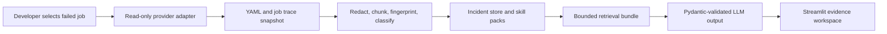

# Architecture

## Design goal

PipelineLens separates deterministic CI analysis from LLM explanation. A model is useful for concise diagnosis, but it is not trusted to discover the pipeline structure or invent the evidence. The application first builds a redacted evidence snapshot, then optionally asks a model to explain that bounded snapshot.

## Main components

| Component              | Responsibility                                                                                   | Important boundary                                                     |
| ---------------------- | ------------------------------------------------------------------------------------------------ | ---------------------------------------------------------------------- |
| Streamlit              | Developer workspace for connecting, selecting jobs, inspecting evidence, and submitting feedback | Contains no provider, storage, or LLM logic.                           |
| FastAPI                | Read-only provider API, orchestration, health checks, feedback endpoints, OpenAPI contract       | Does not persist raw PAT values.                                       |
| GitHub/GitLab adapters | Normalize repositories, bounded project trees, failed runs, jobs, traces, and CI files           | Both implement the same `CiProvider` interface.                        |
| YAML graph service     | Maps jobs, `needs`, artifacts, rules, scripts, and source lines                                  | Uses `ruamel.yaml` source marks instead of model guesses.              |
| Log service            | Redacts, chunks, extracts code locations, classifies, fingerprints                               | Runs before database, retrieval, UI, and LLM use.                      |
| Incident store         | Stores redacted incidents and confirmed-resolution feedback                                      | Uses SQLite locally and PostgreSQL in Compose/cloud.                   |
| Skill packs            | Versioned runbooks with evidence requirements and prohibited actions                             | Public, reviewable, and separate from model weights.                   |
| LLM diagnoser          | Produces strict JSON only from retrieved evidence                                                | Rejects uncited or unknown citations and falls back deterministically. |

## Data flow

1. FastAPI uses a session-supplied PAT to invoke only provider `GET` endpoints, including a bounded project-tree view.
2. The provider returns a selected run, job, CI configuration bundle, and trace.
3. `PipelineAnalyzer` fetches run/job and YAML/trace concurrently where possible.
4. The parser creates a graph from GitHub workflow jobs or GitLab stages/jobs/local includes.
5. The redactor masks common credentials. The chunker retains meaningful line ranges around commands, tests, HTTP errors, and stack traces; compiler/runtime locations are extracted where the trace supplies file and line data.
6. The fingerprint service normalizes volatile data and produces a stable incident key.
7. The retriever selects a fixed small set of current evidence, similar incidents, and one skill pack.
8. The LLM, when enabled, returns Pydantic-validated JSON whose citations must belong to that set. Otherwise the deterministic diagnosis is rendered.
9. Only redacted incident data and approved feedback are persisted.

## GitLab multi-document YAML

Modern GitLab pipelines can place `spec:` inputs in an initial YAML document, followed by `---` and the pipeline definition. PipelineLens parses every YAML document in a GitLab file, aggregates jobs/stages/includes, and preserves source locations. GitHub Actions workflows remain deliberately single-document.

This behavior was validated against a real self-hosted GitLab pipeline in read-only, in-memory mode. The check retrieved a failed job trace, parsed the multi-document root CI file, built an executable job graph, mapped the failed job to YAML, extracted source references, redacted the trace, and emitted only count/category booleans outside the local process.

## Scaling without unbounded agent memory

The application does not store whole conversations as agent memory. It persists normalized incident records and redacted chunks, then retrieves a bounded evidence set for each diagnosis. The default bundle contains current trace chunks, one YAML/job source excerpt, up to two historical incidents, and one matching skill pack.

For the Compose/cloud deployment, PostgreSQL is packaged with pgvector. The current local implementation uses fingerprint and lexical hybrid retrieval to remain self-contained; the data/retrieval boundary supports adding native pgvector similarity and approved embedding providers without changing UI or provider code.
